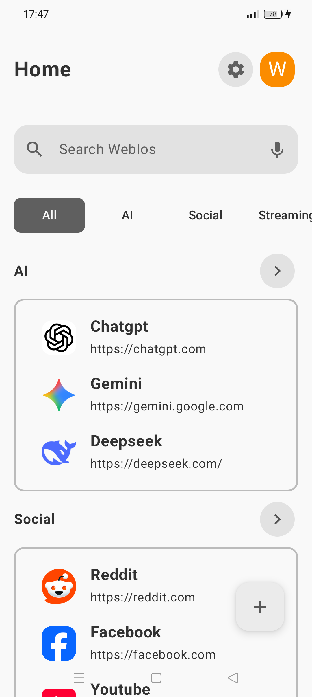
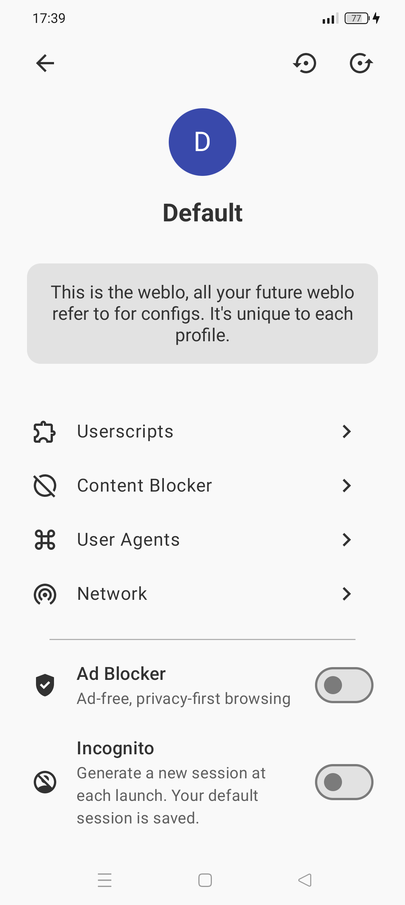
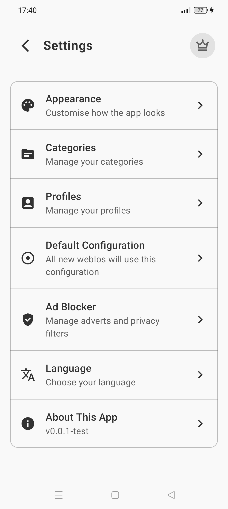

<h3 align="center">Weblo - Make the Web Yours, on Android</h3>

A browser-shaped toolkit that lets you bend the internet to fit you.

> ### Disclaimer
> Weblo **is not open source and is __currently under development__**. This GitHub repo is for bug reports, feature requests, translations, docs, and other non-code contributions only. Core app code is closed-source.

<picture>
   <source media="(prefers-color-scheme: dark)" srcset="./img/night/Screenshot_home.png" width="250">
   
</picture>
<picture>
   <source media="(prefers-color-scheme: dark)" srcset="./img/night/Screenshot_config.png" width="250">
   
</picture>
<picture>
   <source media="(prefers-color-scheme: dark)" srcset="./img/night/Screenshot_settings.png" width="250">
   
</picture>

Weblo is built for people who want more control: block what you don’t need, automate with userscripts, keep pages offline, organize with profiles and categories, and inspect what’s really happening behind the scenes. Simple for everyday browsing, powerful when you want to dig deeper.

## Contribution

Your feedback helps us make Weblo more powerful, more robust, and more to your liking.

* If you have encountered a bug, please file a [🐞 Bug Report](https://github.com/ycngmn/Weblo/issues/new?template=bug_report.yml).
* If you are missing a feature in Weblo, you can [💡 Request a Feature](https://github.com/ycngmn/Weblo/issues/new?template=feature_request.yml).
* Use the [💬 Discussions tab](https://github.com/ycngmn/Weblo/discussions) to share your thoughts or seek help using the software.

Don't hesitate to create an issue, even for a tiny detail. All requests are treated with attention.

### Translation

Weblo currently supports 23 languages, most of which are implemented using generative AI. Thus, the quality of translations is not guaranteed.  
If you are a native speaker or have skills in one of the supported languages, feel free to contribute to the translations.

* Translations don't need to be exact — you can express things in your own words.
* It doesn't matter whether you have used AI, as long as you validate the quality.
* If you want to add a new language, please contact the developer beforehand.